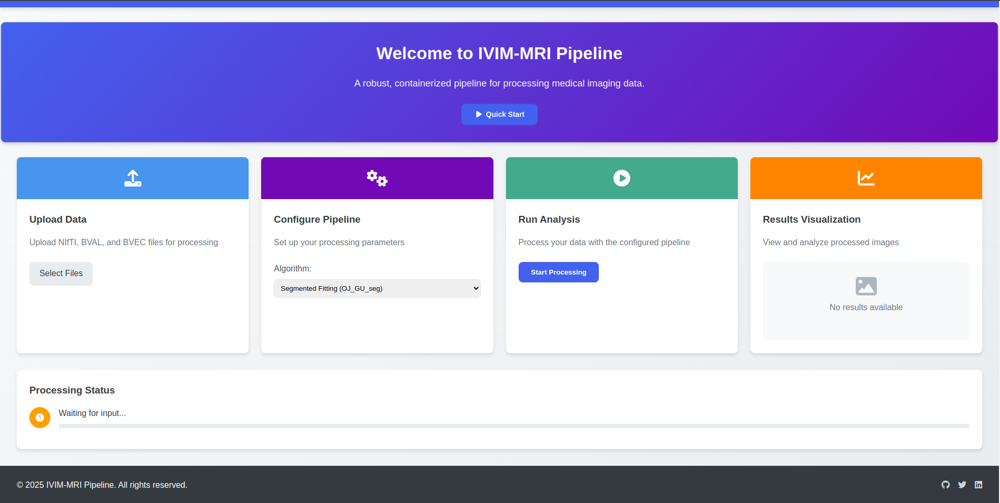

This project aims to develop a containerized pipeline that can efficiently process medical imaging data using IVIM or other tools. The modularized docker images will encapsulate all necessary dependencies, enabling cross-platform deployment, execution and integration with clinical imaging pipelines. Finally, we want to enable visual orchestration of the resulting pipeline through a web-based interface.
